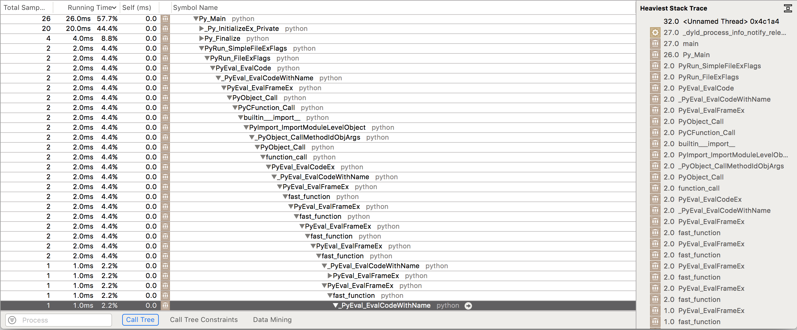

class: center, middle

# Rust & Rustconf 2017

---

# Agenda

1. Introduction to Rust
2. Quick Summary of Rustconf 2017

---

# Introduction to Rust

## Why Rust?

* Low-Level Language (more about what this means)
* Memory safety without Garbage Collection
* Pattern Matching & Algebraic Data Types
* Macro System (WIP)
* More?

---

# Low-Level Languages

**Low Level**: You can sort-of imagine how what you type will
be tranlated to assembly. You *know* the layout of the data.

**High Level**: No idea what will actually run. No idea what the data
will look like.

---
C

<div style="-webkit-column-count: 2; -moz-column-count: 2; column-count: 2; -webkit-column-rule: 1px dotted #e0e0e0; -moz-column-rule: 1px dotted #e0e0e0; column-rule: 1px dotted #e0e0e0;">
    <div style="display: inline-block;">
        <pre><code class="c">#include <stdio.h>

void doit() {
  int a = 10;
  int b = 2;
  int c = a * b;
  printf("%d\n", c);
}

int main() {
  doit();
}
</code></pre>
    </div>
    <div style="display: inline-block;">
        <pre><code class="asm">_main:                                  ## @main
	.cfi_startproc
## BB#0:
	pushq	%rbp
Lcfi3:
	.cfi_def_cfa_offset 16
Lcfi4:
	.cfi_offset %rbp, -16
	movq	%rsp, %rbp
Lcfi5:
	.cfi_def_cfa_register %rbp
	leaq	L_.str(%rip), %rdi
	movl	$20, %esi
	xorl	%eax, %eax
	callq	_printf
	xorl	%eax, %eax
	popq	%rbp
	retq
	.cfi_endproc
</code></pre>
    </div>
</div>

---
Rust

<div style="-webkit-column-count: 2; -moz-column-count: 2; column-count: 2; -webkit-column-rule: 1px dotted #e0e0e0; -moz-column-rule: 1px dotted #e0e0e0; column-rule: 1px dotted #e0e0e0;">
    <div style="display: inline-block;">
        <pre><code class="rust">fn doit() {
  let a = 10;
  let b = 3;
  let c = a * b;
  println!("{}", c);
}

fn main() {
  doit();
}
</code></pre>
    </div>
    <div style="display: inline-block;">
        <pre><code class="asm">printsum::main::ha8a34770bfdb071c:
	.cfi_startproc
	pushq	%rbp
Lcfi0:
	.cfi_def_cfa_offset 16
Lcfi1:
	.cfi_offset %rbp, -16
	movq	%rsp, %rbp
Lcfi2:
	.cfi_def_cfa_register %rbp
	subq	$80, %rsp
	movl	$30, -4(%rbp)
	leaq	-4(%rbp), %rax
	movq	%rax, -24(%rbp)
	movq	core::fmt::num::_$LT$impl$u20$core..fmt..Display$u20$for$u20$i32$GT$::fmt::h43d81c1fc28956d2@GOTPCREL(%rip), %rax
	movq	%rax, -16(%rbp)
	leaq	_ref.2(%rip), %rax
	movq	%rax, -72(%rbp)
	movq	$2, -64(%rbp)
	movq	$0, -56(%rbp)
	leaq	-24(%rbp), %rax
	movq	%rax, -40(%rbp)
	movq	$1, -32(%rbp)
	leaq	-72(%rbp), %rdi
	callq	std::io::stdio::_print::hfac875b2ad1f5df3
	addq	$80, %rsp
	popq	%rbp
	retq
	.cfi_endproc
</code></pre>
    </div>
</div>

---
Python

```python
def doit():
    a = 10
    b = 2
    c = a * b
    print(c)

doit()
```



---

# Low-Level Language

* The **Computer** is the interpreter (VM).

* Data types match the computer's types, plus extensions. (Types not
  *Boxed* by default).

## Why do I care?

* Performance by default.
* Easier to control data-layout to optimize performance.

---

# Memory safety without Garbage Collection

* There are cases where GC can be *faster* than
  `malloc/free`. E.g. `free`ing very deeply nested data structures.

* It's more about control. GC makes pauses unpredictable.

